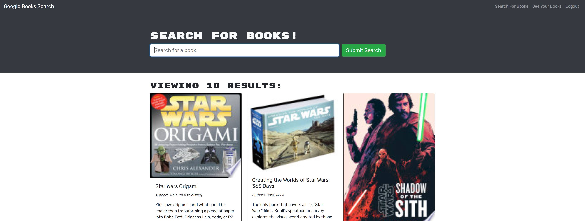

# Module 21 - MERN Book Search Engine

## Description

a GraphQL and mongoose based program that uses a google api to search and store a variety of books, restored from old code.

## Table of Contents 

* [Installation](#installation-instructions)

* [Usage](#usage-information)

* [License](#license)

* [Contributing](#contributing-guidelines)

* [Tests](#test-instructions)

* [Questions](#questions)

## Installation Instructions

Please follow these steps when running this application.   1. git clone the repository to your local machine.  2. In terminal, CD into the applications folder.  3. Type and enter 'npm install' to install the dependencies.  4. Type and enter 'npm run build' if you want to build the application.  5. Type and enter 'npm run start' to run the application, the application will be live on your localhost. 

## Usage Information

This project should be used as an example of a how graphQL and mongoose operate together. TypeRef, mutations etc.

Sample:

## License

MIT: Permissive free license software. Please visit https://opensource.org/licenses/MIT for more information.
  
## Contributing Guidelines

Flipper5001 was the sole contributer for this project. If you wish to make any contributions, please refer to the questions section for our contact information.

## Test Instructions

tests were not required for this project.

## Questions

Other works can be found on https://github.com/Flipper5001.

If you have any questions or queries, please contact the following email address and we will get back to you as soon as possible.  
placeholder@gmail.com

## Link to site
https://m21-book-search.herokuapp.com/